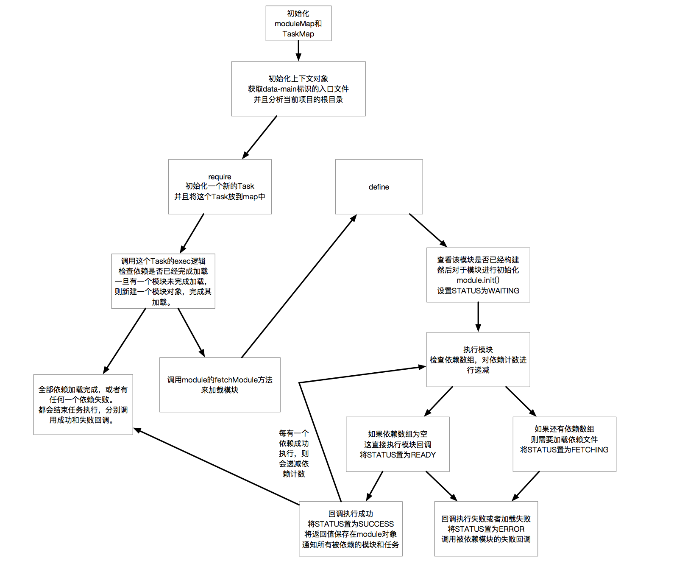

## 一个简单的RequireJS的实现

这个项目主要是为了测试RequireJS的处理流程而写的一个代码项目。学习ing。

### 主要数据结构

#### 上下文(Context)


用来保存当前require执行环境，以及内部的module和task的map数据结构。并且在初始化过程中，对于data-main入口文件进行加载。

```typescript
class Context {
  public basePath: string;
  public entryFile: string;
  public bodyDOM: HTMLBodyElement;
  public moduleMap: ModuleMap;
  public taskMap: TaskMap;
}
```

#### 模块(Module)

对于依赖模块的处理，module是含有状态的：

* `STATUS.WAITING`: 初始化模块，等待模块被开始加载。
* `STATUS.FETCHING`: 模块正在进行网络请求获取。
* `STATUS.READY`: 模块相关依赖都加载完成并且成功，准备开始执行回调。
* `STATUS.SUCCESS`: 模块回调执行成功，这时候会通知当前所有依赖该模块的任务或者模块。
* `STATUS.ERROR`: 当前模块依赖出错，或者是回调函数执行失败、没有返回值，这时候会通知所有依赖该模块的任务或者模块，执行其失败回调。

通过状态来控制当前模块的操作，通过`depsCount`的存取器来捕获依赖的处理结果，当依赖计数减为0的时候，表示依赖处理完成。

```typescript
class Module {
  private readonly _id: number;
  public name: string;
  private _STATUS: STATUS = STATUS.WAITING;
  private _callback: Callback;
  private _error: ErrorCallback | undefined;
  private _deps: string[];
  private _depsCount: number;
  private _context: Context;
  private _task: (string | number)[] = [];
  private _export: any;
  private _errorEvent: Error | undefined;
}
```

#### 任务(Task)

对于所有require的任务进行处理，也同样通过`depsCount`的存取器来捕获依赖处理结果，但是这个数据类型并不包含状态，只是通过回调来处理依赖完成或者失败后的结果，这个模块中也需要对于相关依赖进行初始化和fetch。

```typescript
class Task {
  private readonly _id: number;
  private _callback: Callback;
  private _error: ErrorCallback | undefined;
  private _deps: string[];
  private _depsCount: number;
  private _context: Context;
}
```

### 简要的逻辑流程



### 目录结构

```
|-- /build/         webpack打包文件和一些测试代码
|-- /dist/          typescript编译之后的文件和sourceMap
|-- /src/           typescript的源代码
|-- tsconfig.js     typescript配置文件
```